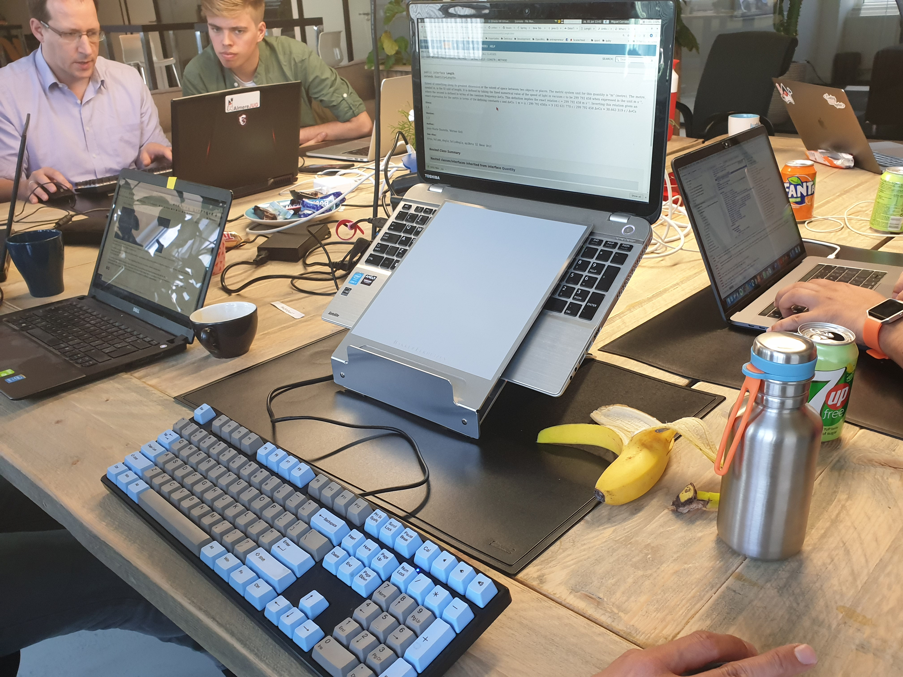

jsr385-demos
============

> Units of Measurement (JSR-385) Demos developed at [Utrecht JUG](https://www.meetup.com/Utrecht-Java-User-Group/)'s [Adopt-a-JSR Day](https://www.meetup.com/Utrecht-Java-User-Group/events/261238917/) (Jun. 1, 2019).

### Introduction
On the 1st of June we hosted JSR-385 Spec Lead [Werner Keil](https://github.com/keilw) in Utrecht for our Adopt-a-JSR Day.

You can see the finished and WIP (for the ones who might be interested in taking it a step further :bowtie:) work below.

### Finished demos
- [Spring Boot demo](spring-boot)
- [Kotlin Repl demo](repl)
- [Vaadin demo](vaadin)

### WIP
- [Spring Boot demo](https://github.com/utrechtjug/adopt-jsr-385-day/tree/master/spring-boot-demo)
- [Some work](https://github.com/mthoolen/indriya/commits/master) for [#128](https://github.com/unitsofmeasurement/indriya/issues/128)

